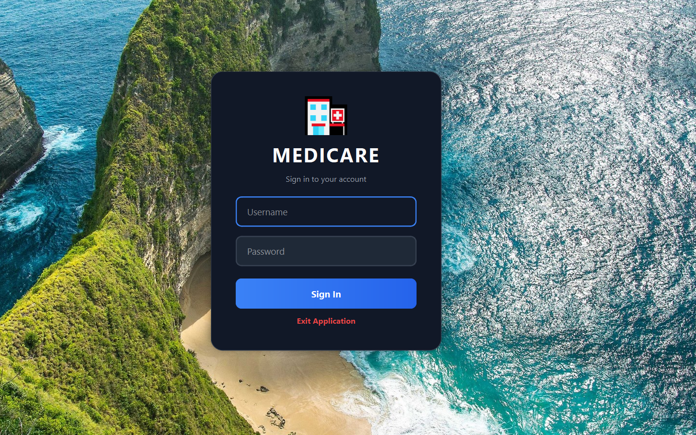
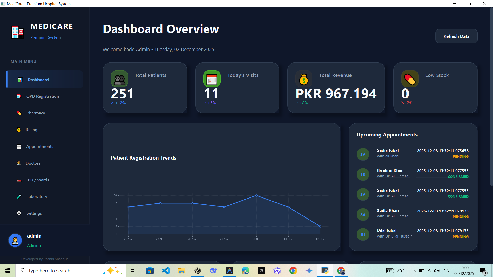
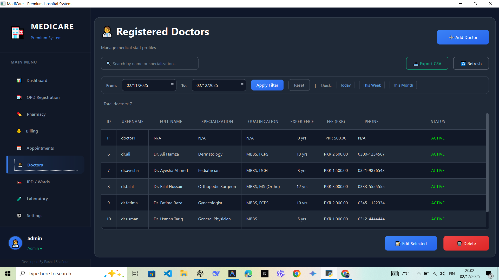
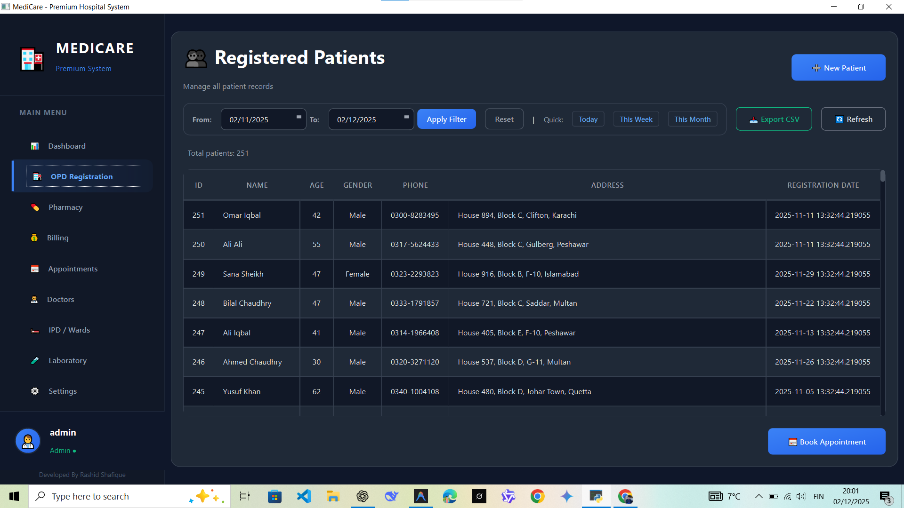
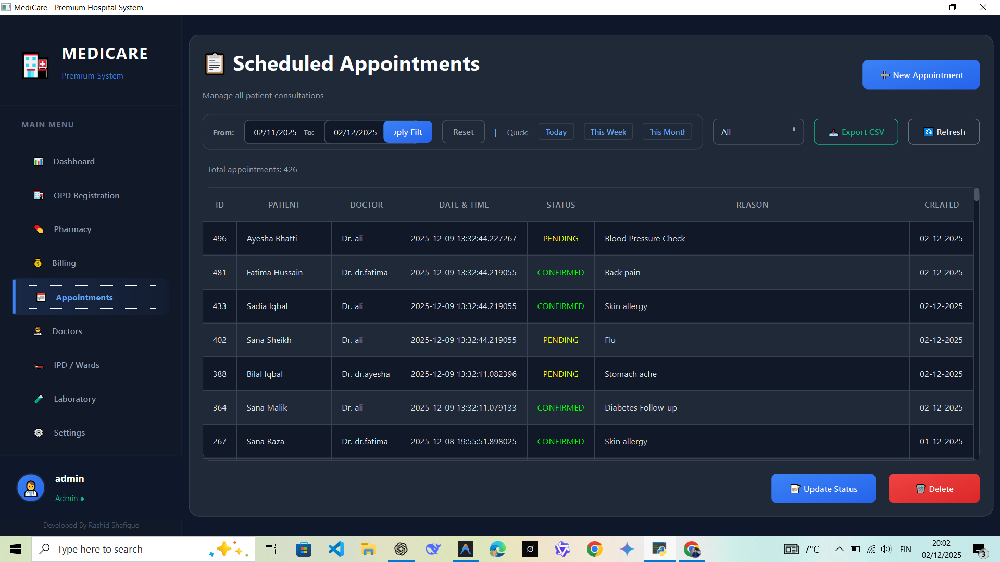
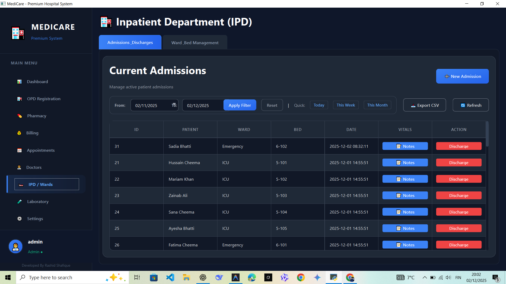
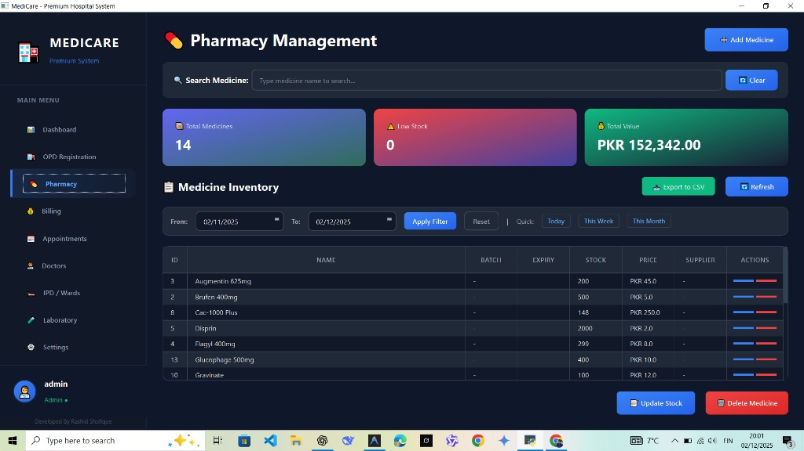
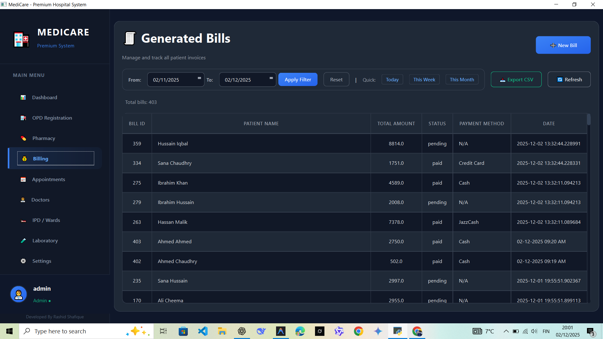

# 🏥 Medicare - Premium Hospital Management System

**Developed by:** Muhammad Rashid Shafique

**Medicare** is a comprehensive, modern desktop application designed to streamline hospital operations. Built with **Python** and **PySide6**, it offers a premium user interface for managing patients, doctors, inventory, and billing with efficiency and style.

---

## 🚀 Key Features

* **📊 Interactive Dashboard:** Real-time analytics for total patients, revenue, visits, and low stock alerts.
* **👨‍⚕️ Doctor Management:** detailed profiles, specialization, fees, and scheduling.
* **🏥 OPD & IPD Management:** Seamless patient registration for Outpatient and Inpatient departments, including ward/bed management.
* **📅 Appointment Scheduling:** Track patient appointments with status updates (Pending/Confirmed).
* **💊 Pharmacy & Inventory:** Live tracking of medicine stock, expiry dates, and supplier details.
* **💰 Smart Billing:** Automated invoice generation with payment tracking (Paid/Pending).
* **🔐 Secure Authentication:** Role-based login system for administrators and staff.

---

## 📸 Application Screenshots

### 1. Secure Login
A secure entry point for authorized personnel.


### 2. Main Dashboard
A high-level overview of hospital performance, financial stats, and patient trends.


### 3. Doctor Management
Manage staff profiles, consultation fees, and specializations.


### 4. OPD Registration (Patient Records)
Efficiently register new patients and search existing records with advanced filtering.


### 5. Appointment Scheduling
Track and manage patient consultations and doctor availability.


### 6. IPD / Ward Management
Manage patient admissions, discharges, and bed allocations in Emergency or ICU wards.


### 7. Pharmacy & Inventory
Monitor medicine stock levels, pricing, and batch details to prevent shortages.


### 8. Billing & Invoices
Generate comprehensive bills and track payment statuses.


---

## 🛠️ Technology Stack

* **Language:** Python 3.x
* **GUI Framework:** PySide6 (Qt for Python)
* **Database:** SQLite3
* **Visualization:** Matplotlib (for Dashboard graphs)
* **Data Handling:** Pandas (for CSV Export functionality)

---

## 📦 How to Run

1.  **Clone the repository** (or download source code).
2.  **Install dependencies:**
    ```bash
    pip install PySide6 matplotlib pandas
    ```
3.  **Run the application:**
    ```bash
    python main.py
    ```

---

## 👤 Author
**Muhammad Rashid Shafique**
*Software Developer | Python Enthusiast*

---
*© 2025 Medicare System. All Rights Reserved.*
