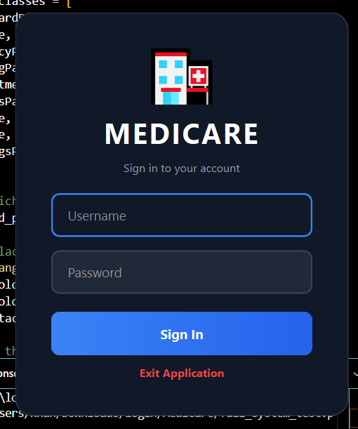
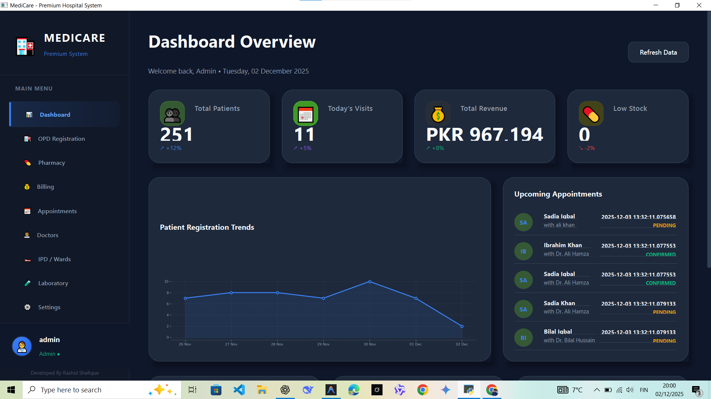
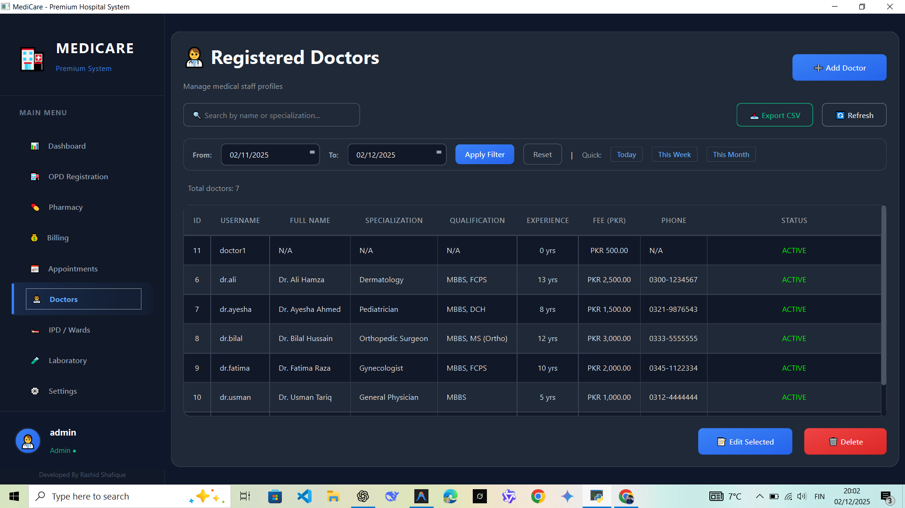
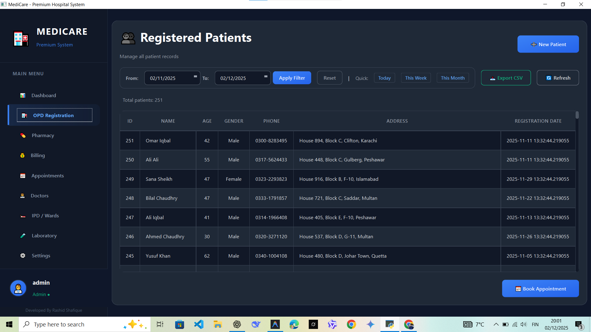
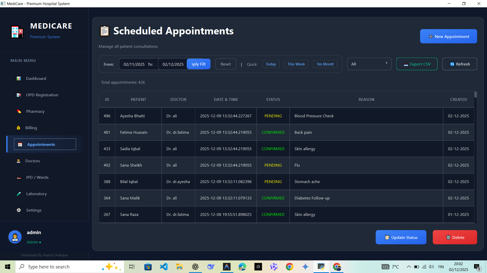
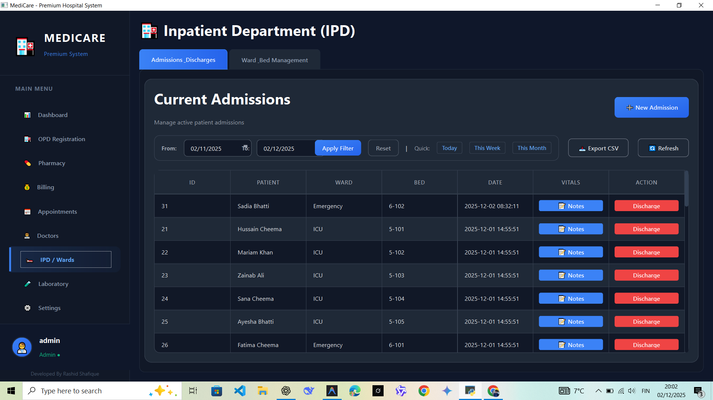
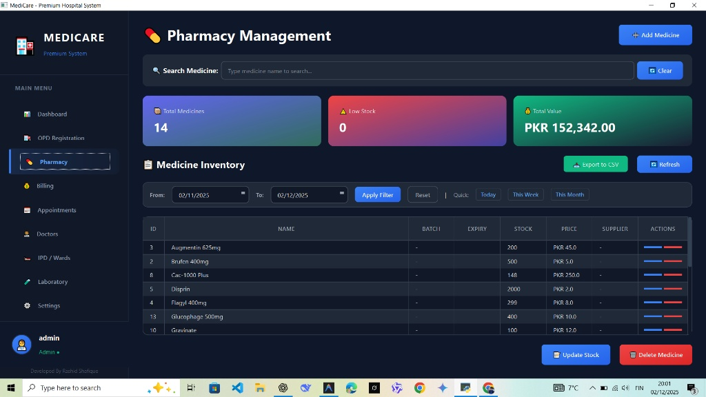
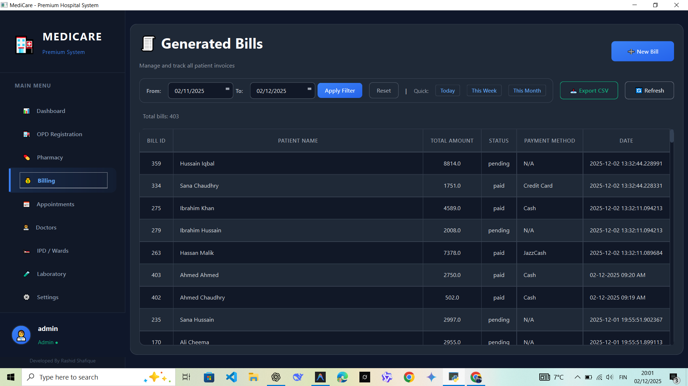

<div align="center">

# 🏥 Medicare
**Premium Hospital Management System**

[](https://www.python.org/)
[](https://doc.qt.io/qtforpython/)
[](https://www.sqlite.org/)
[](https://opensource.org/licenses/MIT)

*A comprehensive, modern desktop application designed to streamline hospital operations with efficiency and style.*

[Explore Features](#-key-features) · [View Screenshots](#-application-screenshots) · [Report Bug](#-contact--author) · [Request Feature](#-contact--author)

</div>

<br />

## 📖 About the Project

**Medicare** is a robust and highly scalable desktop application tailored for the dynamic needs of modern hospitals and clinics. Built entirely on **Python** and **PySide6**, it brings a premium, visually appealing, and intuitive user interface to healthcare management. From real-time analytics to automated billing, Medicare ensures that medical staff can focus more on patient care rather than administrative overhead.

---

## ✨ Key Features

| Category | Features |
| :--- | :--- |
| **📊 Interactive Dashboard** | Real-time analytics, total patients, revenue tracking, visits, and low stock alerts. |
| **👨‍⚕️ Doctor Management** | Detailed profiles, specialization categorization, consultation fees, and scheduling. |
| **🏥 OPD & IPD Management** | Seamless patient registration for Outpatient/Inpatient departments, ward & bed allocation. |
| **📅 Appointment Scheduling** | Track and organize patient consultations with live status updates (Pending/Confirmed). |
| **💊 Pharmacy & Inventory** | Live tracking of medicine stock, expiry dates, supplier details, and shortage prevention. |
| **💰 Smart Billing** | Automated, comprehensive invoice generation with real-time payment tracking (Paid/Pending). |
| **🔐 Secure Authentication** | Robust role-based login system for administrators and staff ensuring data privacy. |

---

## 📸 Application Screenshots

<div align="center">
  <table>
    <tr>
      <td align="center">
        <br/>
        <b>🔒 Secure Login</b><br/><i>A secure entry point for authorized personnel.</i>
      </td>
      <td align="center">
        <br/>
        <b>📊 Main Dashboard</b><br/><i>A high-level overview of hospital performance.</i>
      </td>
    </tr>
    <tr>
      <td align="center">
        <br/>
        <b>👨‍⚕️ Doctor Management</b><br/><i>Manage staff profiles and specializations.</i>
      </td>
      <td align="center">
        <br/>
        <b>📝 OPD Registration</b><br/><i>Efficient patient records & advanced filtering.</i>
      </td>
    </tr>
    <tr>
      <td align="center">
        <br/>
        <b>📅 Appointment Scheduling</b><br/><i>Track patient consultations & doctor availability.</i>
      </td>
      <td align="center">
        <br/>
        <b>🛏️ IPD / Ward Management</b><br/><i>Manage admissions, discharges, and beds.</i>
      </td>
    </tr>
    <tr>
      <td align="center">
        <br/>
        <b>💊 Pharmacy & Inventory</b><br/><i>Monitor stock levels, pricing, and batches.</i>
      </td>
      <td align="center">
        <br/>
        <b>💰 Billing & Invoices</b><br/><i>Generate comprehensive bills and track payments.</i>
      </td>
    </tr>
  </table>
</div>

---

## 🛠️ Technology Stack

| Technology | Purpose |
| :--- | :--- |
|  | Core Application Logic |
|  | Modern GUI Framework |
|  | Lightweight Relational Database |
|  | Dashboard Visualizations & Graphs |
|  | Data Handling & CSV Export |

---

## 🚀 Getting Started

Follow these instructions to set up the project locally on your machine.

### Prerequisites

Ensure you have Python 3.x installed on your system. You can download it from [python.org](https://www.python.org/).

### Installation Steps

1. **Clone the repository:**
   ```bash
   git clone https://github.com/yourusername/medicare-system.git
   cd medicare-system
   ```

2. **(Optional) Create a virtual environment:**
   ```bash
   python -m venv venv
   source venv/bin/activate  # On Windows use `venv\Scripts\activate`
   ```

3. **Install the required dependencies:**
   ```bash
   pip install PySide6 matplotlib pandas
   ```

4. **Run the application:**
   ```bash
   python main.py
   ```

---

## 👨‍💻 Contact & Author

<div align="center">
  <b>Muhammad Rashid Shafique</b> <br>
  <i>Software Developer | Python Enthusiast</i>
  <br><br>
  
  [](https://www.linkedin.com/in/your-profile)
  [](https://github.com/yourusername)
</div>

---

<div align="center">
  <i>© 2025 Medicare System. All Rights Reserved.</i><br>
  Designed with ❤️ for healthcare professionals.
</div>
